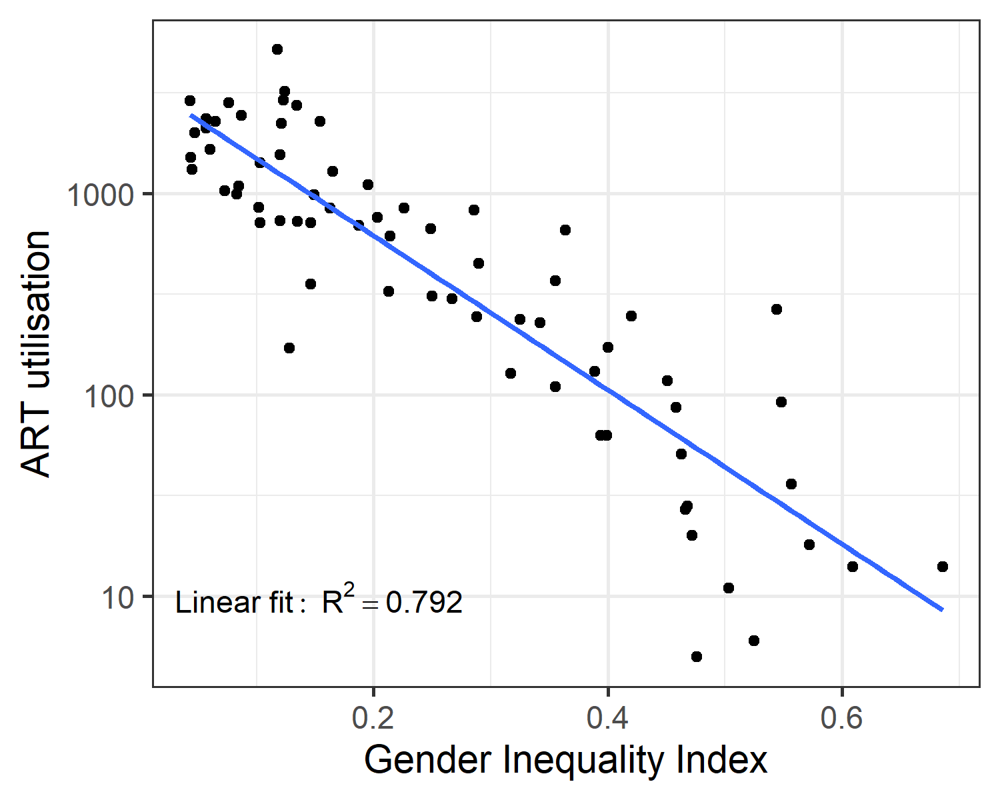

# Background

This is the code repository for the research paper:

Fitzgerald O, Dyer S, Zegers-Hochschild F, Keller, E, Adamson GD, Chambers GM. (forthcoming). Gender inequality and utilisation of assisted reproductive technology: an international cross-sectional and longitudinal analysis

Please contact g.chambers@unsw.edu.au if you have any questions about the research.

# Reproducing the analysis

The following steps will reproduce the results present in the paper. Bear in mind 
that as part of the analysis consists of Markov Chain Monte Carlo base imputation running the full analysis at once can take several hours.

steps...
